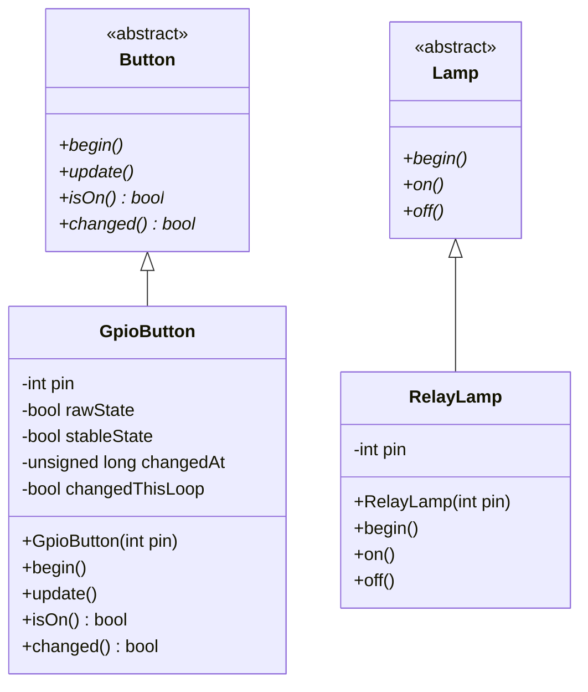

```mermaid
classDiagram
    %% Hardware
    class Button {
        <<abstract>>
        +begin()*
        +update()*
        +isOn()* bool
        +changed()* bool
    }
    class Lamp {
        <<abstract>>
        +begin()*
        +on()*
        +off()*
    }
    class GpioButton {
        +GpioButton(int pin)
        -int pin
        -bool rawState
        -bool stableState
        -unsigned long changedAt
        -bool changedThisLoop
        +begin()
        +update()
        +isOn() bool
        +changed() bool
    }
    class RelayLamp {
        +RelayLamp(int pin)
        -int pin
        +begin()
        +on()
        +off()
    }
    Button <|-- GpioButton
    Lamp <|-- RelayLamp


    %% The tree

```