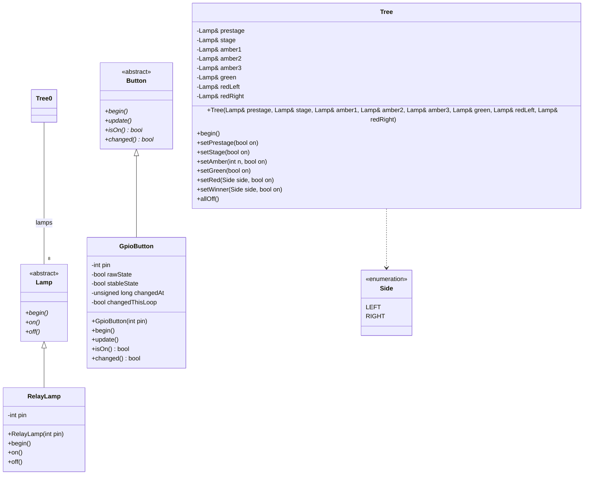

```mermaid
classDiagram
    %% Hardware
    class Button {
        <<abstract>>
        +begin()*
        +update()*
        +isOn()* bool
        +changed()* bool
    }
    class Lamp {
        <<abstract>>
        +begin()*
        +on()*
        +off()*
    }
    class GpioButton {
        +GpioButton(int pin)
        -int pin
        -bool rawState
        -bool stableState
        -unsigned long changedAt
        -bool changedThisLoop
        +begin()
        +update()
        +isOn() bool
        +changed() bool
    }
    class RelayLamp {
        +RelayLamp(int pin)
        -int pin
        +begin()
        +on()
        +off()
    }
    Button <|-- GpioButton
    Lamp <|-- RelayLamp


    %% The tree
    class Tree {
        -Lamp& prestage
        -Lamp& stage
        -Lamp& amber1
        -Lamp& amber2
        -Lamp& amber3
        -Lamp& green
        -Lamp& redLeft
        -Lamp& redRight
        +Tree(Lamp& prestage, Lamp& stage, Lamp& amber1, Lamp& amber2, Lamp& amber3, Lamp& green, Lamp& redLeft, Lamp& redRight)
        +begin()
        +setPrestage(bool on)
        +setStage(bool on)
        +setAmber(int n, bool on)
        +setGreen(bool on)
        +setRed(Side side, bool on)
        +setWinner(Side side, bool on)
        +allOff()
    }
    class Side {
        <<enumeration>>
        LEFT
        RIGHT
    }
    Tree 0-- "8" Lamp : lamps
    Tree ..> Side

```