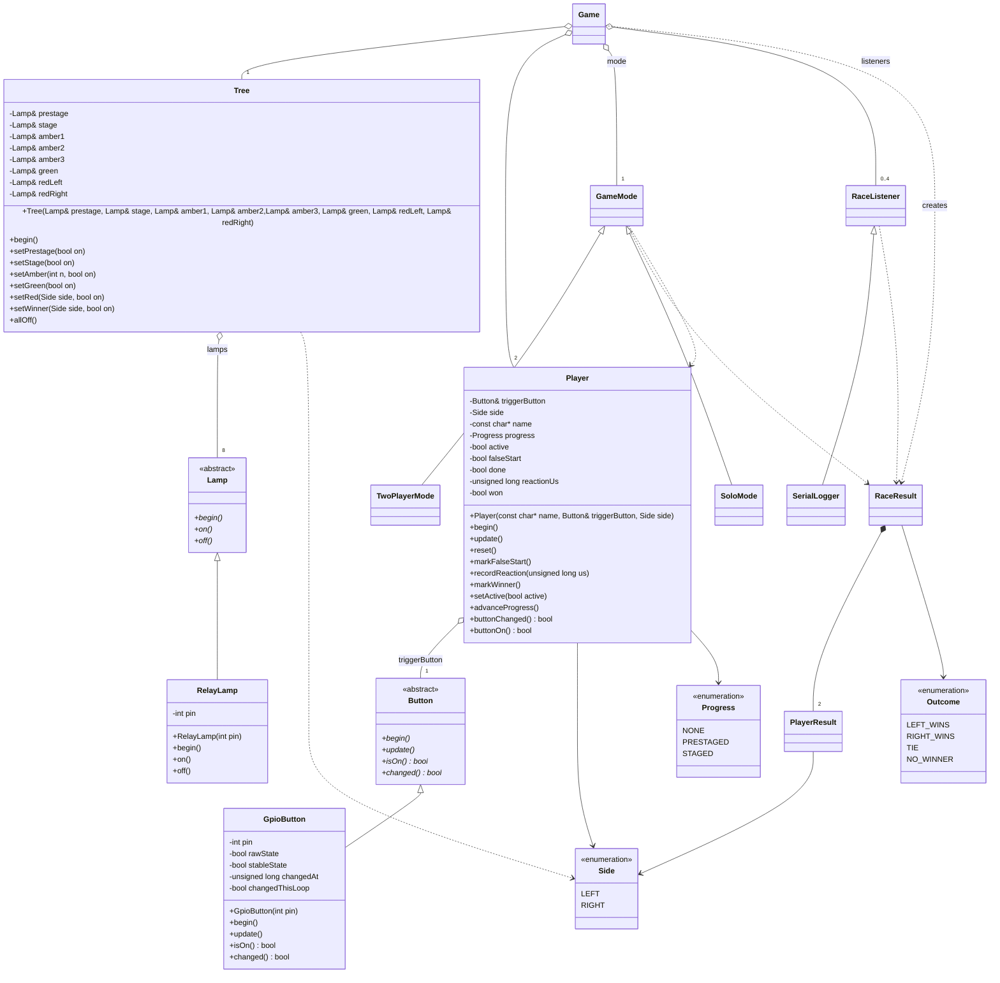

```mermaid
classDiagram
    %% Hardware
    class Button {
        <<abstract>>
        +begin()*
        +update()*
        +isOn()* bool
        +changed()* bool
    }
    class Lamp {
        <<abstract>>
        +begin()*
        +on()*
        +off()*
    }
    class GpioButton {
        +GpioButton(int pin)
        -int pin
        -bool rawState
        -bool stableState
        -unsigned long changedAt
        -bool changedThisLoop
        +begin()
        +update()
        +isOn() bool
        +changed() bool
    }
    class RelayLamp {
        +RelayLamp(int pin)
        -int pin
        +begin()
        +on()
        +off()
    }


    %% The tree
    class Tree {
        -Lamp& prestage
        -Lamp& stage
        -Lamp& amber1
        -Lamp& amber2
        -Lamp& amber3
        -Lamp& green
        -Lamp& redLeft
        -Lamp& redRight
        +Tree(Lamp& prestage, Lamp& stage, Lamp& amber1, Lamp& amber2,Lamp& amber3, Lamp& green, Lamp& redLeft, Lamp& redRight)
        +begin()
        +setPrestage(bool on)
        +setStage(bool on)
        +setAmber(int n, bool on)
        +setGreen(bool on)
        +setRed(Side side, bool on)
        +setWinner(Side side, bool on)
        +allOff()
    }
    class Side {
        <<enumeration>>
        LEFT
        RIGHT
    }


    %% The game
    class Player {
        +Player (const char* name, Button& triggerButton, Side side)
        -Button& triggerButton
        -Side side
        -const char* name 
        -Progress progress
        -bool active
        -bool falseStart
        -bool done
        -unsigned long reactionUs
        -bool won
        +begin()
        +update()
        +reset()
        +markFalseStart()
        +recordReaction(unsigned long us)
        +markWinner()
        +setActive(bool active)
        +advanceProgress()
        +buttonChanged() bool
        +buttonOn() bool
    }

    class RaceResult {

    }

    class PlayerResult {

    }

    class GameMode {

    }

    class TwoPlayerMode {

    }

    class SoloMode {

    }

    class Game {

    }

    class Outcome {
        <<enumeration>>
        LEFT_WINS
        RIGHT_WINS
        TIE
        NO_WINNER
    }

    class Progress {
        <<enumeration>>
        NONE
        PRESTAGED
        STAGED
    }


    %% Result out
    class RaceListener {

    }

    class SerialLogger {

    }


    %% All associations

    %% Inheritance
    Button <|-- GpioButton
    Lamp <|-- RelayLamp
    GameMode <|-- TwoPlayerMode
    GameMode <|-- SoloMode
    RaceListener <|-- SerialLogger

    %% Aggregation
    Tree o-- "8" Lamp : lamps
    Player o-- "1" Button : triggerButton
    Game o-- "1" Tree
    Game o-- "2" Player
    Game o-- "1" GameMode : mode
    Game o-- "0..4" RaceListener : listeners

    %% Composition
    RaceResult *-- "2" PlayerResult

    %% Association
    Player --> Side
    Player --> Progress
    PlayerResult --> Side
    RaceResult --> Outcome
    
    %% Dependency
    Tree ..> Side
    Game ..> RaceResult : creates
    GameMode ..> RaceResult
    RaceListener ..> RaceResult
    GameMode ..> Player

```